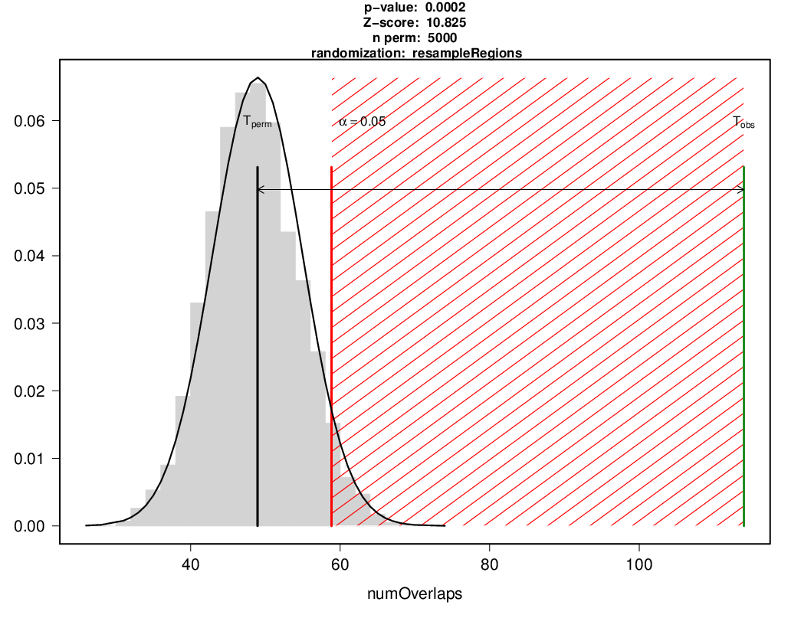
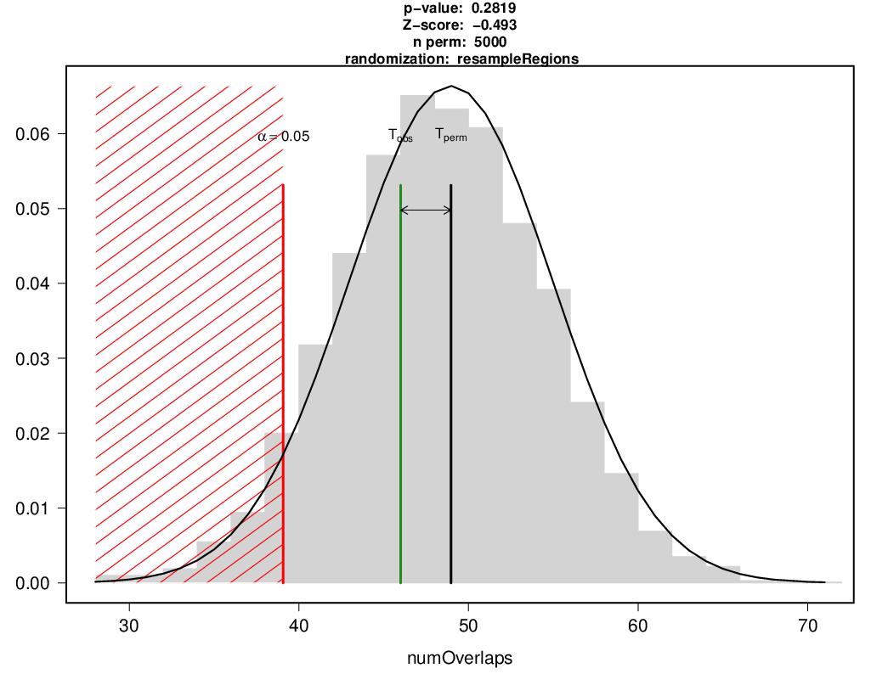
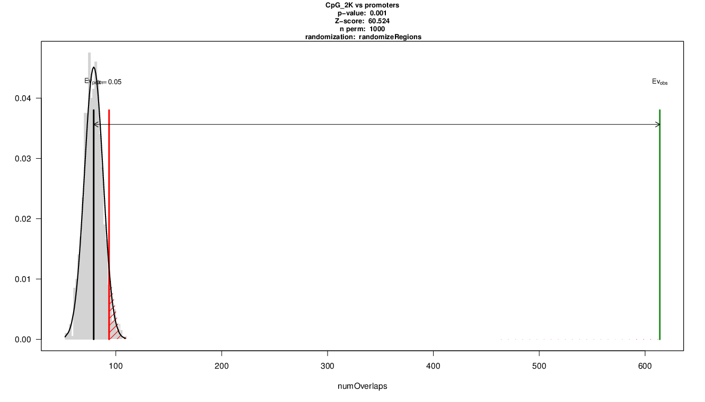
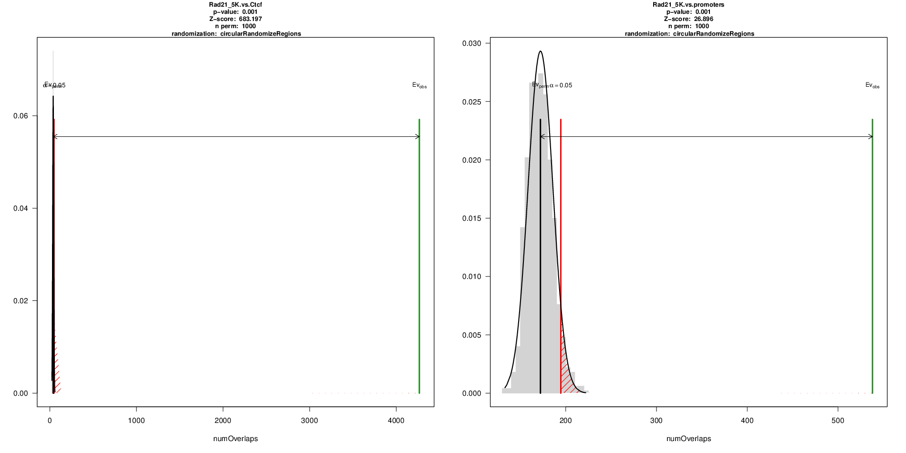
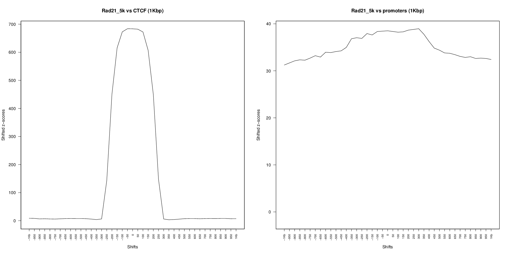
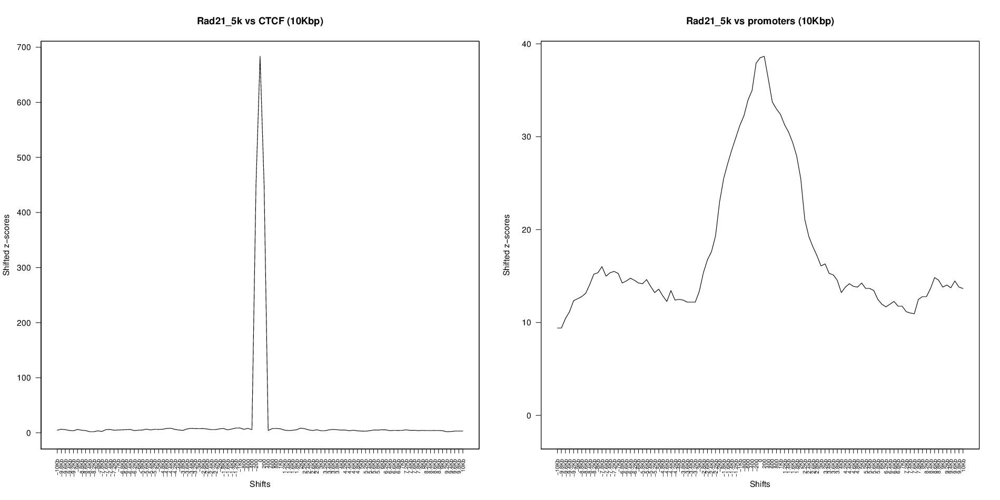
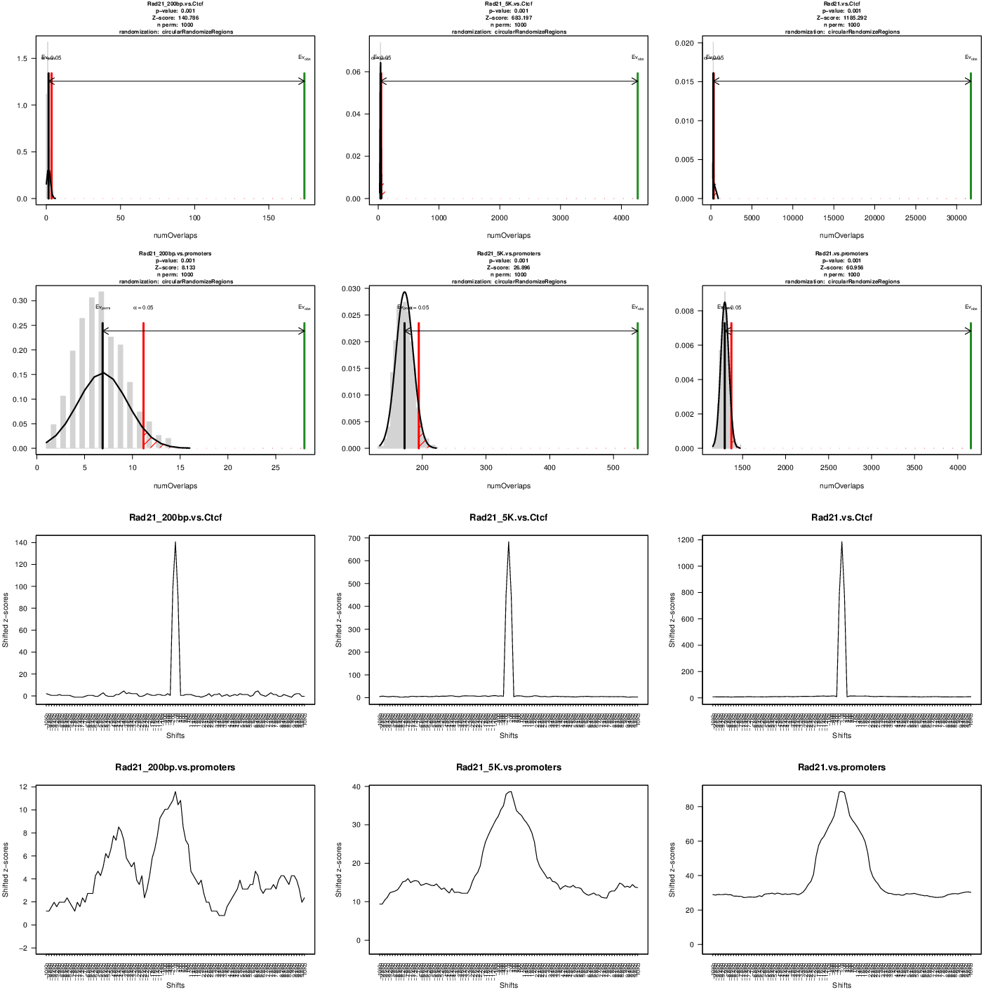
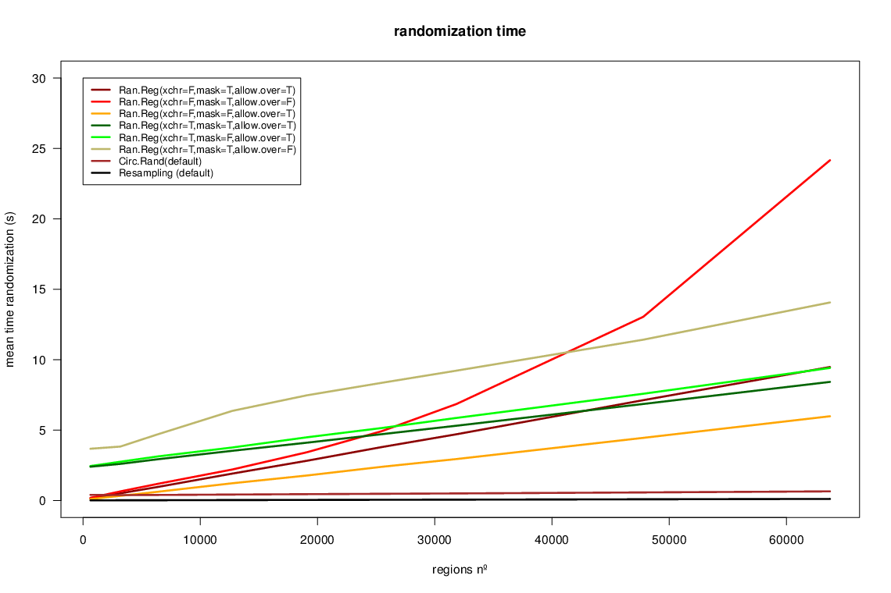
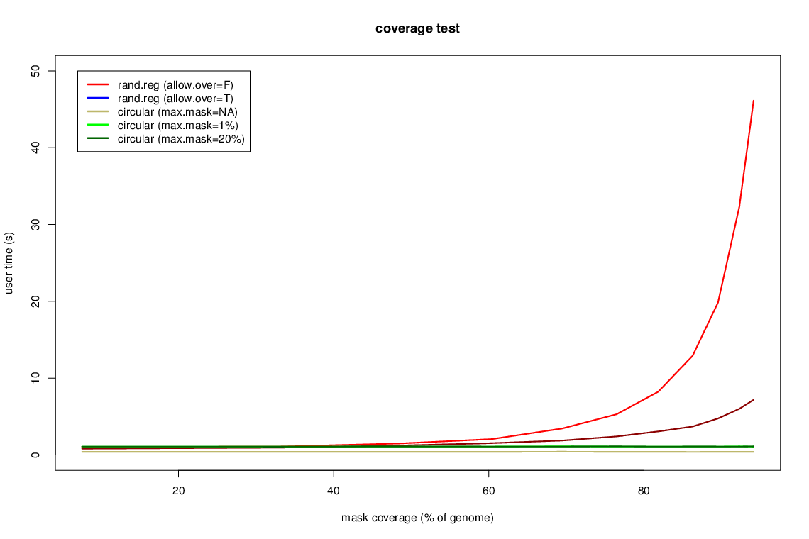

```{r, include=FALSE}
library(knitr)
library(regioneR)
opts_chunk$set(concordance=FALSE)
set.seed(21666641)
```


# Introduction

The important technological advances we have seen since the publication of the human genome such as microarrays and NGS technologies have allowed us to produce massive amounts of data, making data analysis and interpretation the bottleneck in genomic and epigenomic research. In many cases, this data can be converted to a set of regions in the genome: the positions of the genes in an expression microarray experiment, the regions with peaks in ChIP-seq data or the contact regions in Hi-C. Statistically assessing the spatial relations between these region sets and other region sets or even other genomic features is a fundamental part of this analysis.


`r BiocStyle::Biocpkg("regioneR")`  has been created to address this problem and provides functions to statistically evaluate the associations between region sets using permutation tests. Its permutation test framework has been specifically designed to work with genomic regions and all functions are genome- and mask-aware. regioneR includes a number of predefined randomization and evaluation functions covering the most frequent use cases, but the user can also provide custom functions to extend its functionality. In addition to textual output, regioneR also can plot the permutation test results and so it's possible to go from a set of genomic regions to a publication ready figure in a few lines of code.

In addition, `r BiocStyle::Biocpkg("regioneR")`  includes a set of helper functions based on Bioconductor's `r BiocStyle::Biocpkg("GenomicRanges")` infrastructure to manage and manipulate region sets with a simple and consistent interface. 


# Quick Start

One of the most common uses of `r BiocStyle::Biocpkg("regioneR")`  is to answer the question: Do the regions in set A overlap with the regions in B more than expected? For example: Are my ChIP-seq peaks on the promoters of active genes? or Are the break points in repetitive regions? To answer question like these we can use the convenience `overlapPermTest` function in regioneR, that evaluates the number of overlaps between two sets of regions. 

To do that, we need to have the two region sets either as a `GRanges`, a `data.frame` or a bed-like file. An practical way to create a `GRanges` is to use the `toGRanges` function. In this case, as an example, we will create two sets of random regions with about 50% overlap.

```{r}
  A <- createRandomRegions(nregions=50, length.mean=5000000, length.sd=3000000)
  B <- c(A[1:25], createRandomRegions(nregions=25, length.mean=500000, length.sd=30000))
  numOverlaps(A, B, count.once=TRUE)
  numOverlaps(randomizeRegions(A), B, count.once=TRUE)
```

Once we have the two region sets, we can test if A overlaps with B more than expected. To do that we will use `overlapPermTest`.

```{r}
  pt <- overlapPermTest(A=A, B=B, ntimes=50)
  pt
```

We can see that the test was significant, with a p-value < 0.05. Now, to plot it, we can simply plot the `pt` object.

```{r, fig.height=6,fig.width=8}
  plot(pt)
```

We can see a visual representation of the results of the test. In grey the number of overlaps of the randomized regions with B, clustering around the black bar that represents the mean and in green the number of overlaps of the original region set A, which is much larger than expected. The red line denotes the significance limit.

In addition, we can test if the association between the two region sets is highly dependant on their exact position. To do that, we can use the `localZScore` function.

```{r, fig.height=6,fig.width=8}
  lz <- localZScore(pt=pt, A=A, B=B)
  plot(lz)
```

Which in this case shows that moving the regions in A produces a drop in the z-scores and so, shows that the association is dependant on the exact position of the regions and is not a regional effect. More information about the `localZScore` function can be found at section [Local Z-score].

In this small example we have used `overlapPermTest` to test the number of overlaps between two region sets. Using the more general `permTest` function, we can test other types of association using different evaluation functions (the distance, the evaluation of a function over the genomes or custom user-defined functions) and applying different types of randomizations. In addition, this example assumes that the data refers to the human genome and uses a default mask with regions not available for the randomization. In the next sections, all these options are explained in detail.


# Permutation tests

The core functionality of regioneR is to statistically evaluate the association between different RS or between a RS and other genomic features using a permutation test approach. This functionality is supported by the `permTest` function, a parallel and highly customizable function performing the permutation tests and producing the statistical evaluation of the results. 

With `permTest` and the right biological data it is possible to answer different types of biological questions such as:


* Do my regions contain more SNPs than expected by chance?
* Are my regions enriched in repetitive regions?
* Are my regions significantly closer to genes?
* Are DNA methylation levels in my RS higher than expected?
* Do my regions overlap with recurrent SCNAs in my samples?
* Are my ChIP peaks associated with that other histone mark?
* Do my ChIP regions associate with repressed genes?


**NOTE:** It is important to take into account, however, that regioneR's permutation tests can only test the association between a set of regions and some other feature but not identify which regions contribute the most to that association. Therefore, for questions of the type "Identify the region in my RS that associate with something"", regioneR is not a suitable choice, and more specific analysis tools should be used. 


## How does a permutation test work?

There are 3 main elements needed to perform a permutation test: our RS, a randomization strategy and an evaluation function. Let's see how it all works with an example:

Imagine we have obtained a set of genes, my special genes, and we want to show they tend to lie in certain parts of the genome, in our case a set of regions we know are altered, for example, they present a copy number gain.

First of all we need to have our RSs loaded into R. To do that we can use the `toGRanges` function.

```{r}
  special <- toGRanges(system.file("extdata", "my.special.genes.txt", package="regioneR"))
  all.genes <- toGRanges(system.file("extdata", "all.genes.txt", package="regioneR"))
  altered <- toGRanges(system.file("extdata", "my.altered.regions.txt", package="regioneR"))

  length(special)
  length(all.genes)
  length(altered)
```

Next thing we need is an evaluation function. In our example we want to test the overlap of our RS with the altered regions, so we will use the `numOverlaps` function, which, given two RS returns the number of overlaps between them.

Using `numOverlaps` we can count the number of overlaps between the two RS, in our case we can compute the number of special genes overlapping an altered region.

```{r}
  numOverlaps(special, altered)
```

But is this number, 114 out of 200, big or small? Does it mean that genes are associated with the altered regions? or might be just by chance? 

Here is where the randomization strategy plays its role. We need a randomization strategy that creates a new set of regions that is random with respect to our evaluation function but takes into account the specificities of our original region set. For example, if our original RS comes from an NGS experiment, all of its regions would lie in mappable parts of the genome and wouldn't make any sense to randomize a region into a centromere or any other non-mappable part of the genome. 

To help with that, many randomization functions provided by `r BiocStyle::Biocpkg("regioneR")`  accept a mask, indicating where a random region cannot be placed. In any case, selecting the best randomization strategy is a key part of a permutation test and can have a great impact in the final results. 

The least restricted function included in `r BiocStyle::Biocpkg("regioneR")`  is `randomizeRegions`, that given a RS, a genome and an optional mask, returns a new RS with the same number of regions and of the same width as the original ones but randomly placed along the non-masked parts of the genome. This is also the slowest of the randomization functions available. 

In our example, since the special genes are a subset of the bigger set of all genes it is much better to use `resampleRegions`, that given a universe of regions, randomly selects a subset of them to create the randomized region sets.

```{r}
  random.RS <- resampleRegions(special, universe=all.genes)
  random.RS
```

Now, we can use the evaluation function to test the level of association of the randomized RS with the altered regions. And we can repeat that and get different evaluations.

```{r}
  random.RS <- resampleRegions(special, universe=all.genes)
  numOverlaps(random.RS, altered)
  random.RS <- resampleRegions(special, universe=all.genes)
  numOverlaps(random.RS, altered)
  random.RS <- resampleRegions(special, universe=all.genes)
  numOverlaps(random.RS, altered)
  random.RS <- resampleRegions(special, universe=all.genes)
  numOverlaps(random.RS, altered)
```

If we do this many times we will build a distribution of the evaluation obtained from random RS and so, we can compare our initial evaluation with those obtained randomly and determine whether it is plausible that our original evaluation was obtained by chance or not. Actually, just counting the number of times the evaluation of the random RS is higher (or lower) than our original evaluation, we can compute the probability of seeing our original evaluation by chance, and that value is exactly the p-value of the permutation test. In addition, we compute the z-score which is the distance between the evaluation of the original RS and the mean of the random evaluations divided by the standard deviation of the random evaluations. The z-score, although not directly comparable, can help in assessing "the strength" of the evaluation.

## How to perform a permutation test with `r BiocStyle::Biocpkg("regioneR")` 

The main function to perform a permutation test with `r BiocStyle::Biocpkg("regioneR")`  is `permTest`, a function taking a a region set (RS) in any of the accepted formats (see section 4 - Region Sets), a randomization function and an evaluation function and returning a `permTestResults` object.

The function performs the whole permutation test analysis described above, evaluating the original RS, creating a number of randomizations and evaluating them and nally computing the p-value and z-score. It takes advantage of the parallel package to randomize and evaluate in parallel where possible.

In addition to the 3 required parameters, `permTest` accepts other fixed parameters -`ntimes` to specify the number of randomizations, `verbose` to toggle the drawing of a progress bar, `force.parallel` to force or forbid the use of multiple cores to run the analysis...- and it also accepts any additional parameter required by the randomization function (usually a genome and a mask) or the evaluation function.

For example to check whether my regions overlap with repeats more than expected, we could use:

```{r, eval=FALSE}
  # NOT RUN
  pt <- permTest(A=my.regions, B=repeats, randomize.function=randomizeRegions,
  evaluate.function=numOverlaps)
```

or if we want to check if my special genes have higher methylation levels we could use a test like this:

```{r, eval=FALSE}
  # NOT RUN
  pt <- permTest(A=my.genes, randomize.function=resampleRegions, universe=all.genes,
  evaluate.function=meanInRegions, x=methylation.levels.450K)
```

Following our example before with my special genes and the altered regions we could call `permTest` like this: 

```{r}
  pt <- permTest(A=special, ntimes=50, randomize.function=resampleRegions, universe=all.genes,
  evaluate.function=numOverlaps, B=altered, verbose=FALSE)
```

**NOTE:** Since `permTest` uses the ellipsis operator (...) to forward the required additional parameters to the evaluation and randomization functions it is strongly recommended to always use named parameters (e.g. A=RS1 instead of only RS1). Failing to do that can result in hard to debug errors.

In any case we would get a `permTestResults` object with the results of the analysis. To view this result we can just print it or use summary. In this case we can see that the association is statistically significant and so we can conclude that the special genes are associated with my altered regions.

```{r}
  pt
  summary(pt)
```

And we can get a graphic representing the results of the permutation test using `plot`. It depicts a gray histogram representing the evaluation of the randomized RS with a fitted normal, a black bar representing the mean of the randomized evaluations and a green bar representing the evaluation of the original RS. In addition, a red bar (and red shading) represents the significance limit (by default 0.05). Thus, if the green bar is in the red shaded region it means that the original evaluation is extremely unlikely and so the p-value will be significant. 

```{r, fig.height=6,fig.width=8}
  plot(pt)
```

To compare, imagine we have a second subset of genes, my regular genes, that are not associated with the altered regions. We can run the same test with them and we will get a negative result. In this case we get a non-significant p-value and we can see in the plot that the original evaluation is close to the mean of the randomized ones.

```{r, fig.height=6,fig.width=8}
  regular <- toGRanges(system.file("extdata", "my.regular.genes.txt", package="regioneR"))

  length(regular)
  numOverlaps(regular, altered)
  pt.reg <- permTest(A=regular, ntimes=50, randomize.function=resampleRegions, universe=all.genes,
  evaluate.function=numOverlaps, B=altered, verbose=FALSE)
  pt.reg
  plot(pt.reg)
```


## A note on the number of permutations
Choosing the right number of permutations is not a simple task. A large number of permutations will produce more accurate results and a nicer-looking plot but a permutation test can be computationally expensive and depending on the number of regions in the RS and the randomization strategy selected it might take up to several hours to perform a permutation test with a few thousand permutations. On the other hand, the lowest p-value is limited by the number of permutations and performing a permutation test with a low permutation number can produce less accurate results. A good strategy could be to try first with a low number of permutations and continue only if the results look promising or at least unclear, since if after some tens of permutations the original evaluation is really close to the mean of the randomizations, the probability it will end up being significant is really small. With a low number of permutations, `r BiocStyle::Biocpkg("regioneR")`  will generate a note stating the lowest p-value achievable and ecouraging to 
increase the permutation number.

As an example, the two permutation tests above, if run with 5000 permutations would produce a plot like these.

```{r, eval=FALSE}
#NOT RUN - See Figure 1
pt.5000 <- permTest(A=special, ntimes=5000, randomize.function=resampleRegions,
universe=all.genes, evaluate.function=numOverlaps, B=altered, verbose=TRUE)
plot(pt.5000)
```



```{r, eval=FALSE}
  #NOT RUN - See Figure 2
  pt.5000.reg <- permTest(A=regular, ntimes=5000, randomize.function=resampleRegions,
  universe=all.genes, evaluate.function=numOverlaps, B=altered, verbose=TRUE)
  plot(pt.5000.reg)
```



## Randomization Functions

Choosing a good randomization strategy is crucial when performing a permutation test. One should choose a randomization strategy that ramdomizes the regions with respect to the association being evaluated while maintaining as much as possible the intrinsic structure and characteristics of the regions. For example, in general it will not make sense to randomize a region into a centromere or into any unavailable region such an unmappable region with NGS data. 


In `r BiocStyle::Biocpkg("regioneR")` , a randomization function is any function that takes a RS as an argument and returns a RS with the randomized regions. Different randomization functions are included in the package, but it is also possible to create custom randomization functions for more specific needs (see section 4 - Region Sets).

### randomizeRegions
This is the most general randomization strategy. It randomly places all regions along the genome independently. The function takes every region in the original RS and randomizes the chromosome and position, while maintaining its size and any associated metadata. The optional mask argument might be used to specify parts of the genome where a region cannot be placed (e.g. centromeres). 

In addition there are two addition parameters:

* **non.overlapping** (default=FALSE): by default, two randomized regions can overlap. Setting non.overlapping to TRUE will force all randomized regions to be non-overlapping. Creating non-overlapping regions is slower.
* **per.chromosome** (default=FALSE):  if this option is set to true, the chromosome is not randomized, but only the position within it. This option can be useful when there original data is intrinsically biased towards some chromosomes or there is an association between the regions and the crhomosomes.


As an example, we can create a RS A with 3 regions in chromosome 1.

```{r}
  A <- toGRanges(data.frame(chr=c("chr1", "chr1", "chr1"), start=c(20000, 50000, 100000), end=c(22000, 70000, 400000)))
```

We can randomize it along the whole genome:

```{r}
  randomizeRegions(A, genome="hg19")
```

In contrast, if we set per.chromosome to TRUE, all randomized regions will be in chr1.

```{r}
  randomizeRegions(A, genome="hg19", per.chromosome=TRUE)
```


### circularRandomizeRegions
Another randomization function available in `r BiocStyle::Biocpkg("regioneR")`  is the circularRandomizeRegion. In this case, instead of randomizing all regions independently, the randomization process maintains the order and distance of the regions, while changing their position in the chromosome. Conceptually, each chromosome is "circularized" and given a random spin while keeping the regions steady. If a mask is specified, in this case, given the greater constrains in the randomization process, it is not possible to ensure that no region will overlap the mask. Instead of that the user can specify the maximum proportion of the regions overlapping the mask. If apter spinning the chromosome too much overlap is detected, a new random spin will be applied. This process will be repeated until a suitable solution if found or max.retries spins have been applied. If after the spinning, a region lies between the end and the start of the chromosome, it will be splitted into two regions. Therefore, the number of regions is not guarateed to be the same as teh original RS. `circularRandomizeRegions` can be significantly faster than `randomizeRegions`.

As an example, we can randomize the same the same RS as before, and observe how the randomized regions are in the same chromosome and at the same relative distance:

```{r}
circularRandomizeRegions(A, genome="hg19", mask=NA)
```


###  resampleRegions
The last available randomization function is resampleRegions. In this case, the original RS is a subset of a finite set of all valid regions called universe. For example, a small set of genes as a subset of all genes in the genome. The randomization process in this case consists in selecting other random members of the universe, it is, resampling it.


## Evaluation Functions
The evaluation functions are the functions that define what is being tested in the permutation test. Some evaluation functions are provided in `r BiocStyle::Biocpkg("regioneR")`  covering the most common uses but it is possible (and easy) to create your own custom evaluation functions (see section 2.6.1). In general, an evaluation function is simply a function taking a RS and returning a single numeric value.


### numOverlaps
The numOverlaps function receives 2 RS A and B and returns the number of regions in A that overlap a region in B. This is the evaluation function used when testing whether our RS A overlaps with a second RS more (or less) than expected by chance -i.e Do my set of ChIP-seq peaks tend to lie on CpG islands?

### meanDistance
If instead of evaluating the overlap between two RS we want to test their distance, we can use meanDistance, which given two RS A and B, computes the mean of the distance from every region in A to the closest region in B. It is useful to answer question of the type "Are my highly expressed genes closer to a certain TFBS than expected by chance?"

### meanInRegion
The meanInRegion function is useful when we want to evaluate the relation of a RS against some sort of numeric value. For example, we could test whether the methylation levels of our RS is higher than expected, or if it accumulates fewer mutation than one would expect.


## Custom Functions

It is possible to use custom randomization and evaluation strategies in permTest. To do so, the user simply needs to create a suitable function and give it as an argument to the permTest function. 


### Custom Evaluation
An evaluation function can be any function with at least a RS as its first parameter and an ellipsis (...) returning a single numeric value. It can also include any other parameters. 

For example, this is a valid (although very slow) function to evaluate the GC content of our regions.

```{r}
gcContent <- function(A, bsgenome, ...) {
A <- toGRanges(A)
reg.seqs <- getSeq(bsgenome, A)
base.frequency <- alphabetFrequency(reg.seqs)
gc.pct <- (sum(base.frequency[,"C"]) + sum(base.frequency[,"G"]))/sum(width(A))
return(gc.pct)
}
```

### Custom Randomization
A randomization function is any function with at least a RS and an ellipsis as parameters and returning a RS. Defining a different and meaningful randomization function, though, is not as easy as coming up with an interesting evaluation function.

For example, a valid randomization strategy could be to permute the metada values associated with each region. This is a simple function that permutes the first column of metadata and returns the permuted RS.

```{r}
permuteRegionsMetadata <- function(A, ...) {
A <- toGRanges(A)
mcols(A)[,1] <- mcols(A)[sample(length(A)),1]
return(A)
}
```

## A note on reproducibility
In order to create reproducible code with functions that use random numbers such as the permutation testing in `r BiocStyle::Biocpkg("regioneR")` , it is necessary to use `set.seed`. However, since regioneR uses `r BiocStyle::Biocpkg("parallel")` to perform the test it is also necessary to set the `mc.set.seed` parameter to FALSE to ensure reproducibility.

```{r}
A <- createRandomRegions(nregions=50, length.mean=5000000, length.sd=3000000)
B <- c(A[1:25], createRandomRegions(nregions=25, length.mean=500000, length.sd=30000))

#Without mc.set.seed=FALSE
set.seed(123)
overlapPermTest(A, B, ntimes=10, force.parallel=TRUE)
set.seed(123)
overlapPermTest(A, B, ntimes=10, force.parallel=TRUE)

#With mc.set.seed=FALSE
set.seed(123)
overlapPermTest(A, B, ntimes=10, mc.set.seed=FALSE, force.parallel=TRUE)
set.seed(123)
overlapPermTest(A, B, ntimes=10, mc.set.seed=FALSE, force.parallel=TRUE)

```


# Local Z-score

The minimum p-value achievable by permutation depends on the number of permutations used. On the other hand, the z-score is a measure of the strength of the association that is independent of the number of permutations. It is defined as the distance between the expected value and the observed one, measured in standard deviations.

When performing an association analysis it is possible to detect associations that, while statistically significant, are not biologically relevant. For example, with ChIP-seq data, it is uaual to detect a significant overlap between broad chromatin marks covering gene-rich regions and transcription factors. This association, while true, is indirect and based on the fact that both regions tend to cluster around genes.

While we can't detect if an association is biologically relevant, with the localZscore function we can at least check if the association is specifically linked to the exact position of the regions in the RS. To do that, the RS is shifted a number of bases to 5' and 3' from its original position and the evaluation function is computed for every shifted RS. Plotting the evaluations over the  shifted positions we can estimate how the value of the z-score changes when moving the regions in the RS: a sharp peak at the center indicates that the association is highly dependent on the exact position of the regions while a flat profile will indicate that the association is regional, since we can move the regions around and obtain the same association values.

For example, in a previous example, we have identified a positive association between a set of "special" genes and a set of altered regions in the genome. The special genes tend to lie inside these alterede regions, but is the association highly dependant on their exact position? Or is it a regional association? To test that, we can move around the position of the genes as evaluate how this position change would affect the z-score.

```{r, fig.height=6,fig.width=8}
pt <- permTest(A=special, ntimes=50, randomize.function=resampleRegions, universe=all.genes,
         evaluate.function=numOverlaps, B=altered, verbose=FALSE)
lz <- localZScore(A=special, pt=pt, window=10*mean(width(special)), 
            step=mean(width(special))/2, B=altered)
plot(lz)
```

In this case we can see that there is no change in the z-scores if we move the regions around. This is expected, since the altered regions are much bigger than the special genes and have a size of tens of megabases and thus, the association is not highly dependant on the exact position of the regions.

On the contrary, we can create an example for an association highly dependant on the exact position by testing the association of a RS with a subset of it. 

```{r, fig.height=6,fig.width=8}

genome <- filterChromosomes(getGenome("hg19"), keep.chr="chr1")
B <- createRandomRegions(nregions=100, length.mean=10000, length.sd=20000, genome=genome,
                   non.overlapping=FALSE)
A <- B[sample(20)]

pt <- overlapPermTest(A=A, B=B, ntimes=100, genome=genome, non.overlapping=FALSE)
pt

lz <- localZScore(A=A, B=B, pt=pt, window=10*mean(width(A)), step=mean(width(A))/2 )
plot(lz)
```

In this case we can see how as soon as we displace the regions a bit away from their original position, the z-score drops almost to 0.


# Region Sets
In `r BiocStyle::Biocpkg("regioneR")` , a genomic region is a part of a genome and is defined by three parameters: chromosome, start and end, where start is less than or equal to end and both are inside the limits of the chromosome. This definition includes from single bases (start equal to end) to whole chromosomes. In addition, genomic regions can have associated data or annotations which will usually depend on the nature of the data. A region set, then, is defined as a group of one or more genomic regions and is referred to as RS along this document.

Internally, `r BiocStyle::Biocpkg("regioneR")`  uses `GRanges` to represent a RS, and all functions returning an RS return a `GRanges` object. However, `r BiocStyle::Biocpkg("regioneR")`  accepts different data formats as input thanks to its `toGRanges` function. In particular, it accepts:


* **GRanges:** A `GRanges` object from the `r BiocStyle::Biocpkg("GenomicRanges")` Bioconductor package.
* **Data Frames:** A `data.frame` or any other class inheriting from it with a "BED-like" structure with the first three columns representing chromosome, start and end. There are a few restrictions regarding the naming of the columns in the data frame which are detailed in the `toGRanges` function help page.
* **A file:** a file name or connection to a file in any of the formats accepted by `r BiocStyle::Biocpkg("rtracklayer")`'s import function (bed, gff, ...)

* **Character strings:** one or more character strings in the form used by UCSC or IGV (e.g. "chr9:23000-25000"). It will correctly deal with commas used as thousands separators 
(e.g. "chr9:23,000-25,000") or as start/end separators (e.g. "chr9:23000,25000)
and any combination of these styles in the same character vector.

Two utility functions are provided in `r BiocStyle::Biocpkg("regioneR")`  to manage the transformation to and from `GRanges`: `toGRanges` and `toDataframe`.


* **`toGRanges`** accepts a RS in any of the supported formats and creates a `GRanges` object from it
* **`toDataframe`** accepts a `GRanges` object and transforms it into a `data.frame`


For example, we can create a `GRanges` from a `data.frame` representing a RS with 3 regions in chromosome 1  with 2 additional values (x and y) using `toGRanges`:

```{r}
A <- data.frame(chr=1, start=c(1,15,24), end=c(10,20,30),  x=c(1,2,3), y=c("a","b","c"))
B <- toGRanges(A)
B
```

and we can get back to a `data.frame` structure using the `toDataframe` function.

```{r}
toDataframe(B) 
```


# Genomes and Masks

Most functions in `r BiocStyle::Biocpkg("regioneR")`  are prepared to work with genomes and masks. The genome represents the complete set of chromosomes available with their length and the mask the set of genomic regions "not available" to work with, for example centromeres, highly repetitive regions, etc... The perfect mask is application specific and might have an important impact on the final results. 

`r BiocStyle::Biocpkg("regioneR")`  provides a function to get genomes and masks, `getGenomeAndMask`, but usually the user won't need to use it directly. In regioneR, all functions accepting a genome and a mask as arguments use this function internally and so, accept any genome and mask specification accepted by these function.

## Genomes
In `r BiocStyle::Biocpkg("regioneR")`  a genome is simply a list of chromosomes and their length. Therefore, it is possible to specify a genome by giving a `data.frame` with 2 columns (`chr` and `length`) or 3 columns (`chr`, `start` and `end`) or a `GRanges` object with one region per chromosome. However, when working with a standard chromosome available as a `BSgenome`, it is possible and much more convenient to rely on the automatic loading of the genome (given that is installed in the system). By specifying the `BSgenome` name of the genome -e.g. hg19, mm9, dm2 ...- regioneR will fetch the correct genome information. 


## Masks
As with genomes, it is possible to specify a mask as a `data.frame` or `GRanges` object with the "forbidden" regions. However, it is also possible and more convenient to use the automatic retrieving of the default mask from `BSgenome` if it's suitable for the application. Again, to automatically retrieve the mask, the masked version of the `BSgenome` must be installed.

## How to retrieve a genome and mask
The `getGenomeAndMask` accepts two parameters, a genome and an optional mask. In general, the genome will be a genome assembly name ('hg19', 'mm10', etc...) and the function will check if there is a genome with that name installed and return it. If none is available, it will prompt the user to install it. If the masked version of the genome is available, that is the one that will be used. If a genome is already available in the form of a `data.frame` or `GRanges` object (or any other valid RS format), the function will return it as a `GRanges`.

The second parameter, `mask`, can be used to specify a mask or to explicitly request no to retrieve one. In particular, if `mask` is NULL (it's default value), it will try to retrieve a mask from the `BSGenome` package, if `mask` is NA it will return an empty mask and if `mask` is anything accepted by `toGRanges` it will return it as the mask.

The function returns a `list` with a genome and a mask elements, both of them `GRanges` objects.


## Filtering Chromosomes
The latest versions of some genomes include a number of additional "chromosomes" representing different alternative assemblies and patches for specific complex regions. While these additional chromosomes are useful in some cases, in others they interfere with the analysis, and so it's best to remove them from the genome. To do that and to generally filter any subset of chromosomes, `r BiocStyle::Biocpkg("regioneR")`  includes the `filterChomosomes` function. It take a RS and returns a filtered version of it containing only the regions in the specified chromosomes. To use it one need to specify the RS, the organism and the type of chromosome to keep (autosomal, canonical, ...). In addition it is possible to specify a custom list of chromosome names to keep.

The available chromosome types are dependant on the organism, and the `listChrTypes` function can be used to see what organisms and chromosome subsets are available.

```{r}
human.genome <- getGenomeAndMask("hg19", mask=NA)$genome
human.canonical <- filterChromosomes(human.genome, organism="hg")
listChrTypes()
human.autosomal <- filterChromosomes(human.genome, organism="hg", chr.type="autosomal")
human.123 <- filterChromosomes(human.genome, keep.chr=c("chr1", "chr2", "chr3"))
```


# Region Set Helper Functions
`r BiocStyle::Biocpkg("regioneR")`  includes a set of helper functions based on the `r BiocStyle::Biocpkg("GenomicRanges")` infrastructure to manage and manipulate RS: `joinRegions`, `commonRegions`, `mergeRegions`, `overlapRegions`, etc... All these functions share a standard and simple signature, with one or two RS in any of the accepted formats and almost all of them (except `splitRegions` and `overlapRegions`) return a `GRanges` object. 


## Functions operating on a single RS


* **extendRegions** This function takes a RS and two integers and extends (enlarges) the regions by the specified amount. If a genome is given, it takes into account the chromosome lengths and does not extend the regions over the chromosome limits. It can take negative extension values to shrink the regions instead of enlarging them.
* **joinRegions:** This function takes a RS and one integer, `min.dist`, and joins the regions that are less than `min.dist` bases apart. 


## Functions operating on two RS


* **commonRegions:** Given two RS A and B this functions returns a `GRanges` object with their intersection, the genomic regions common to both of them. 
* **mergeRegions:** Given two RS A and B this functions returns a `GRanges` object with the regions of the genome contained in either of them, it is equivalent to merging the to RS into one and then fusing the overlapping regions.
* **subtractRegions:** Given two RS A and B this functions returns a `GRanges` object with the regions in A not present in B, it is, the regions in A minus the parts overlapping those in B.
* **uniqueRegions:** Given two RS A and B this functions return a `GRanges` object with the regions of the genome covered by A or B but not both.


## Other Functions: functions not returning a `GRanges` object


* **overlapRegions:** `overlapRegions` is one of most powerful and useful RS management functions in `r BiocStyle::Biocpkg("regioneR")` . It has a number of parameters and types of returned values. For a thorough description, refer to the regioneR user guide.

Given two RS A and B, `overlapRegions` identifies the regions in A overlapping a region in B, filters them and returns them. It is possible to filter by the relation between the regions (e.g. "the region from A must be included in the one from B") or by the amount of overlap (e.g. "at least 10 bases", "at least half the region in A"). The returned value might be a complete table with information, for every overlap, of the region in A, the region in B and their relation, a boolean vector indicating for every region in A whether it overlaps any region in B following the filtering criteria or simply the number of valid overlaps between the two RS. In addition, it is possible to specify if the additional data columns associated with the RS have to be kept or might just be ignored.

**Example:** Given the two same RS each with 10 regions in chromosome 1 we have been using so far we can get the complete table with their overlaps:

```{r}
overlaps.df <- overlapRegions(A, B)
overlaps.df
```

We can filter the overlaps and get only those where a region from A contains a region from B. Additionally, get the number of bases of the region from A covered by the region from B:

```{r}
overlaps.df <- overlapRegions(A, B, type="BinA", get.pctA=TRUE)
overlaps.df
```

Or get only the overlaps of at least 5 bases

```{r}
overlaps.df <- overlapRegions(A, B, min.bases=5)
overlaps.df
```

or boolean vector indicating the regions in A overlapping a region in B with 5 or more bases (this is very handy to subset a RS based on how the regions overlap another RS)

```{r}
overlaps.bool <- overlapRegions(A, B, min.bases=5, only.boolean=TRUE)
overlaps.bool
```

or the number of regions in A overlapping a region from B with at least 5 bases

```{r}
overlaps.int <- overlapRegions(A, B, min.bases=5, only.count=TRUE)
overlaps.int
```


# Usage Examples

In this section we will present a series of examples of how to use `r BiocStyle::Biocpkg("regioneR")`  to answer real biological questions.

## Example 1: CpG Islands and Gene Promoters. A basic example.

### Question: Are Cpg islands and promoters associated?

#### Brief Problem Description:
Gene promoter regions are GC rich and there are many CpG islands that lie inside promoters. However, is there a statistically significant association between them? Do CpG islands overlap with promoters more than one would expect by chance?

#### Datasets:
We will use the CpG islands described in Wu et al. 2010 and the promoters from UCSC defined as -2000 to +200 base pairs to the TSS according to the genome assembly hg19. The promoters file can be dowloaded from [http://gattaca.imppc.org/regioner/data/UCSC.promoters.hg19.bed](http://gattaca.imppc.org/regioner/data/UCSC.promoters.hg19.bed).

```{r, eval=FALSE}
  #NOT RUN
  set.seed(12345) 
  cpgHMM <- toGRanges("http://www.haowulab.org/software/makeCGI/model-based-cpg-islands-hg19.txt")
  promoters <- toGRanges("http://gattaca.imppc.org/regioner/data/UCSC.promoters.hg19.bed")
```

#### Step-by-step analysis:

The idea of the test is to randomly move the CpG islands along the genome and count how many of them overlap with a promoter. Since we want to test whether two sets of regions have an overlap higher than expected and we don't need a special randomization strategy, we can use the convenience function `overlapPermTest`, that uses `permTest` under the hood, but presets some parameters for us (in particular, it uses `numOverlaps` as the evaluation function and `randomizeRegions` as the randomization strategy).  

To start, we will remove the promoters and CpG islands in non-canonical chromosomes, so we are restricted to the standard part of the genome and remove any redundance they might include. 

```{r, eval=FALSE}
  #NOT RUN
  cpgHMM <- filterChromosomes(cpgHMM, organism="hg", chr.type="canonical")
  promoters <- filterChromosomes(promoters, organism="hg", chr.type="canonical")
```
  
In addition, to speed-up the example, we will use a subset of 2000 out of the 65699 CpG islands in the region set. While in general the whole region set should be used, in many cases a large enough subset should give an idea about association. Using the whole set is perfectly possible and will simply be slower.

To ensure that we will count a CpG island only once even if it overlaps 2 or more promoters, we use the parameter `count.once=TRUE`, that will be automatically passed to the `numOverlaps` function. In general, any parameter needed by the randomization or evaluation function can be given here and will be used by the relevant function. 

```{r, eval=FALSE}
  #NOT RUN
  cpgHMM_2K <- sample(cpgHMM, 2000)

  pt <- overlapPermTest(cpgHMM_2K, promoters, ntimes=1000, genome="hg19", count.once=TRUE)
  pt
    P-value: 0.000999000999000999
    Z-score: 60.5237
    Number of iterations: 1000
    Alternative: greater
    Evaluation of the original region set: 614
    Evaluation function: numOverlaps
    Randomization function: randomizeRegions
  mean(pt$permuted)
  79.087
```

The p-value obtained (>0.001) shows us a strong association. 614 out of 2000 CpG islands overlap at least one promoter while a mean of only 79.087 islands overlapped a promoter in the randomized region sets. These results can be summarised in a single plot by plotting the `perTestResults`.

```{r, eval=FALSE}
  #NOT RUN
  plot(pt)
``` 




In the plot we can see in grey the distribution of the evaluation of the randomized regions, in green the evaluation of the original region set (in this case, the 614 CpG islands that overlap at least one promoter), and in red the significance limit. The the high z-score and the plot make evident the extreme significance of the association tested.

#### References:

Wu H, Caffo B, Jaffe HA, Feinberg AP, Irizarry RA (2010) Redefining CpG Islands Using a Hierarchical Hidden Markov Model. Biostatistics 11(3): 499-514. 


## Example 2: Analysis of ChIP-seq peaks. Advanced usage and local Z-score.

### Question: In the cell line Hepg2 (Human hepatocellular carcinoma ), is Rad21 (Cohesin) associated with CTCF? And with gene promoters? Are these associations different?

#### Brief Problem Description:
The structural role of the CTCF protein in eukaryotic genomes and its association with the cohesin complex is well reviewed in Ong & Corces, 2014. The cohesin complex consists in four subunits, Scc1 (Rad21), Scc3, Smc1 and Smc3, forming a ring structure. Cohesin is also associated to promoters with or without CTCF (Ong & Corces 2011).
We want to test if the peaks determined in a ChIP-seq experiment with Rad21 overlap more than expected with the peaks generated with a CTCF ChIP-seq experiment. We also want to test if the Rad21 peaks overlap with promoters more tahn expected. In addition, we want to see if these two associations are somewhat different.

#### Datasets:

The Rad21 and CTCF ChIP-seq peaks are taken from the ENCODE project (http://www.genome.gov/encode/). The peak files can be downloaded from the UCSC and read using the `toGRanges` function. The promoters will be the same as in Example 1, that is, -2000/+200 around the UCSC TSS.

```{r, eval=FALSE}
  #NOT RUN
  set.seed(12345) 
  download.file("http://hgdownload-test.cse.ucsc.edu/goldenPath/hg19/encodeDCC/wgEncodeAwgTfbsUniform/wgEncodeAwgTfbsSydhHepg2Rad21IggrabUniPk.narrowPeak.gz", "Rad21.gz")

  download.file("http://hgdownload-test.cse.ucsc.edu/goldenPath/hg19/encodeDCC/wgEncodeAwgTfbsUniform/wgEncodeAwgTfbsUwHepg2CtcfUniPk.narrowPeak.gz", "Ctcf.gz")

  HepG2_Rad21 <- toGRanges(gzfile("Rad21.gz"), header=FALSE)
  HepG2_Ctcf <- toGRanges(gzfile("Ctcf.gz"), header=FALSE)

  promoters <- toGRanges("http://gattaca.imppc.org/regioner/data/UCSC.promoters.hg19.bed")
```


#### Step-by-step analysis:

  We will start the analysis by removing any feature in non-canonical chromosomes using `filterChromosomes`. In this case only `promoters` has regions in other chromosomes. In addition, to speed up the analysis we will use only a subset of 5000 out of the 37233 Rad21 peaks. At the end of the example there is some more information about the subset size.
 
```{r, eval=FALSE}
  #NOT RUN
  promoters <- filterChromosomes(promoters, organism="hg19")
  HepG2_Rad21_5K <- sample(HepG2_Rad21, 5000)
```

  To test the associations between Rad21 and CTCF or promoters we will use the `permTest` function. We want to test if the region sets overlap more than expected, so we will use `numOverlaps` as the evaluation function, passing it the `count.once` parameter so each region in A is counted at most once. As the randomization function we will use `circularRandomizeRegions`, since it is faster than `randomizeRegions`, will keep the internal structure of the region set (won't change the distance between adjacent regions) and we are not testing against such distances. With that function it might not be possible to ensure a perfect exclusion of the masked regions, but in this case we can tolerate that too. In general, in many situations, `circularRandomizeRegions` is a suitable replacement to `randomizeRegions` with the benefit of being much faster. We will also set `mc.cores=4` so 4 processor cores are used and `mc.set.seed=FALSE` to ensure a reproducible result. These two parameters not generally needed. 
  
  **IMPORTANT NOTE:** It is very important to pass the name the parameters passed to `permTest`, since it makes use of the ellipsis operator `...` and might produce unexpected errors if arguments are passed without a name.
  
```{r, eval=FALSE}
  #NOT RUN
  pt_Rad21_5k_vs_Ctcf <- permTest(A=HepG2_Rad21_5K, B=HepG2_Ctcf, ntimes=1000,
                                  randomize.function=circularRandomizeRegions,
                                  evaluate.function=numOverlaps, count.once=TRUE,
                                  genome="hg19", mc.set.seed=FALSE, mc.cores=4)

  pt_Rad21_5k_vs_Prom <- permTest(A=HepG2_Rad21_5K, B=promoters, ntimes=1000,
                                  randomize.function=circularRandomizeRegions,
                                  evaluate.function=numOverlaps, count.once=TRUE,
                                  genome="hg19", mc.set.seed=FALSE, mc.cores=4)

  pt_Rad21_5k_vs_Ctcf

  pt_Rad21_5k_vs_Prom

  plot(pt_Rad21_5k_vs_Ctcf, main="Rad21_5K vs CTCF")
  plot(pt_Rad21_5k_vs_Prom, main="Rad21_5K vs Promoters")
```



We can see that both tests are significant with a very low p-value. In fact, they both share the lowest possible p-value with this number of randomizations, since no single randomized region set produced an evaluation value higher than the original set. However, the association with CTCF is far more extreme and actually the z-score is about 25 times higher for CTCF than for the promoters. It makes sense, since about 85% of the Rad21 peaks overlap with CTCF but only 11% overlap with gene promoters. 

To further investigate the nature of the associations, we will use the `localZscore` function, that will move the original regions around and see the effect in the z-score. In this case, we will start with a window of 1000bp and a step of 50bp. To run the local z-score analysis, we need to give it the original region set A, the results of the permutation test and the additional parameters needed by the evaluation function, in this case, `B=HepG2_Ctcf` and `count.once=TRUE`.

```{r, eval=FALSE}
  #NOT RUN
  lz_Rad21_vs_Ctcf_1 <- localZScore(A=HepG2_Rad21_5K, B=HepG2_Ctcf, 
                                    pt=pt_Rad21_5k_vs_Ctcf, 
                                    window=1000, step=50, count.once=TRUE)

  lz_Rad21_vs_Prom_1 <- localZScore(A=HepG2_Rad21_5K, B=promoters,
                                    pt=pt_Rad21_5k_vs_Prom,
                                    window=1000, step=50, count.once=TRUE)
  
  plot(lz_Rad21_vs_Ctcf_1, main="Rad21_5k vs CTCF (1Kbp)")
  plot(lz_Rad21_vs_Prom_1, main="Rad21_5k vs promoters  (1Kbp)")

```




Analysing how the z-score changes when the Rad21 regions are moved around their original position, we can see a very different profile. In the case of the association with CTCF, a narrow peak is evident. This means that if the original regions, the Rad21 peaks were displaced 300bp to either side, the z-score of the association would drop to almost zero. A clear narrow peak like this one indicates that the association is highly dependant on the exact position of the peaks, what makes sense in this case given the already described colocalization of CTCF and Rad21. In the case of the promoters, however, we can see that there is no drop in the z-score when the regions are moved. This suggests that the association we are seeing is more regional and it does not depend so strictly on the exact position of the regions. 

Increasing the window value to 10000bp and the step to 200bp, we can see a broader view of the z-score change and we can see how there's a drop of z-score, but at a much higher distance, which indicates either wider regions or some kind of regional association.

```{r, eval=FALSE}
  #NOT RUN
  lz_Rad21_vs_Ctcf_2 <- localZScore(A=HepG2_Rad21_5K, B=HepG2_Ctcf,
                                    pt=pt_Rad21_5k_vs_Ctcf,
                                    window=10000, step=500, count.once=TRUE)

  lz_Rad21_vs_Prom_2 <- localZScore(A=HepG2_Rad21_5K, B=promoters,
                                    pt=pt_Rad21_5k_vs_Prom,
                                    window=10000, step=500, count.once=TRUE)     
  
  plot(lz_Rad21_vs_Ctcf_2, main="Rad21_5k vs CTCF (10Kbp)")
  plot(lz_Rad21_vs_Prom_2, main="Rad21_5k vs promoters  (10Kbp)")
```




**Note:** In many cases, it is possible to use a subset of the regions to get a first glimpse of the association before testing with the whole set of regions. However, the size of the subset is important. In the figure there are the results of testing the association of Rad21 with CTCF and the gene promoters with three different subset sizes: 200, 5000 and all the Rad21 reagions. It is clear that the 5000 subset is capable of detecting the association with both sets of regions but the 200 subset detects the very strong association with CTCF but fails to clearly detect the association with the promoters. 




#### References:

Ong CT, Corces VG. Enhancer function: new insights into the regulation of tissue-specific gene expression. Nat Rev Genet. 2011 Apr;12(4):283-93.

Ong CT, Corces VG. CTCF: an architectural protein bridging genome topology and function. Nat Rev Genet. 2014 Apr;15(4):234-46.


# Benchmarks and Performance


The main focus of `r BiocStyle::Biocpkg("regioneR")`  is not speed but flexibility. However, the most time consuming parts of the test, mainly the randomization functions, have been optimized and perform quite well (although still far from pure C implementations such as bedtools). In this section we present a comparison of the performance of the different available functions.

## Randomization Functions
The process of randomizing the position of the regions over the genome can be difficult and time consuming. The different functions available in `r BiocStyle::Biocpkg("regioneR")`  vary a lot in their complexity and performance, ranging from the simplest and fastest resampleRegions, that randomly selects  a subset of regions from a finite universe of possible regions supplied by the user, to the slowest and most complex randomizeRegions, that creates truly random region among the genome, taking into account a mask of non selectable parts of the genome and even ensuring that there is no overlap between the randomized regions. 

Here is a brief description of the algorithmic comlexity of each randomization function:

* **resampleRegions:** This is the fastest of the built-in randomization functions. It uses `sample` to select `N` regions from a user provided universe. It is basically a linear algorithm with respect to the number of regions.
* **circularRandomizeRegions:** This is also a fast algorithm that maintains the distance between the regions in the region set but randomizes their position in the chromosome. There is a tradeoff between speed and the portion of regions overlapping the mask, since it will randomly "spin" the chromosome until it finds a randomized region set that has an overlap with the mask below the maximum allowed. Thus, it's cost is linear with the number of regions in the region set when the portion of the genome covered by the mask plus the RS is low but will increase rapidly if the mask is dense.
* **randomizeRegions:** This function completely randomizes the regions along the genome. Internally, it has three different algorithms, a fast linear one, that places the regions in the genome very fast but it's not guaranteed to succeed for all the regions, a linear but slower one, that places the regions in the genome taking into account the mask and is guaranteed to succeed for all regions if they fit in the available space, and a quadratic algorithm that randomly places the regions in the available space without overlaps between them. The final algorithm is a combination of the three, with a very good behaviour with sparse masks and region sets that can become slower when the percentage of the genome covered by the mask or the regions is hight and specially slow if no overlaps between the random regions are allowed.


In these two plots you can see the time required to randomize a region set of variable size in different conditions with these algorithms.






# Technical Considerations

## Memoisation

`r BiocStyle::Biocpkg("regioneR")`  uses `r BiocStyle::Biocpkg("memoise")` to speed up the genome and mask retrieval functions, since they can be quite slow. Thus, the first call to `getGenomeAndMask` (which is called from all functions accepting a genome) will have an additional delay of almost 30s. After that call, the genome and mask retrieval is almost intantaneous, since the result has been cached. In some special cases, one might want to remove the cache and retrieve the genome and mask from the original source. To do so, we have included the function `emptyCacheRegioneR` that will forget the cached versions of genomes and masks.


# Session Info
```{r, sessionInfo}
sessionInfo()
```


